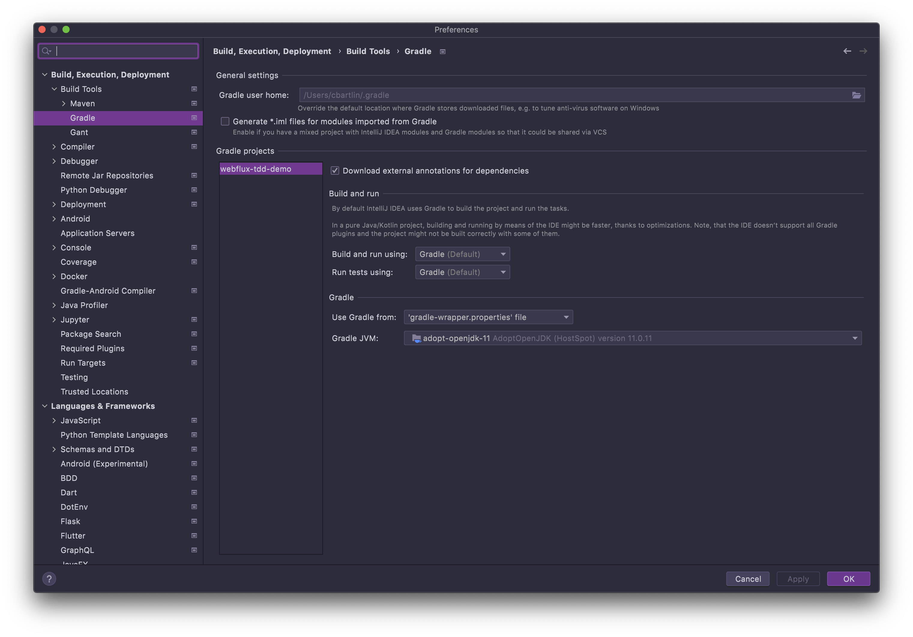
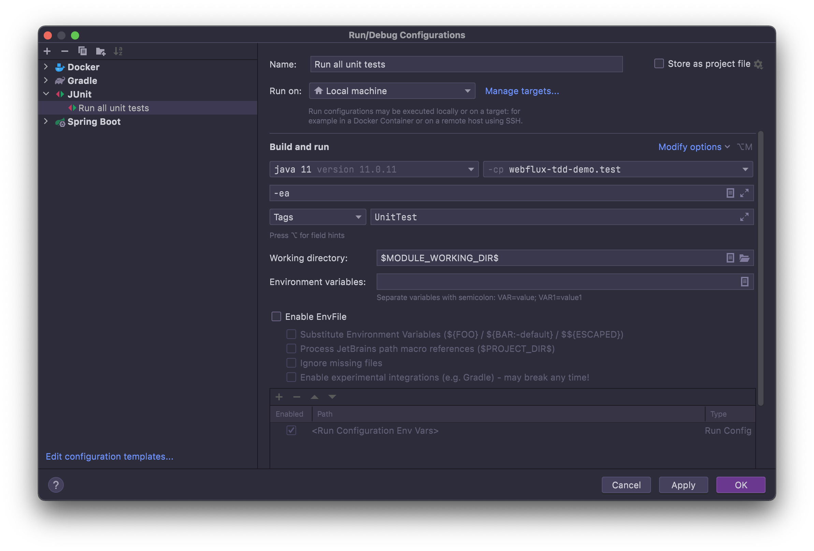

# Spring WebFlux/Project Reactor TDD Demonstration

## Prerequisites 

- Java 11 SDK 
- Docker

## Configuring the Java environment and IntelliJ IDEA project

1. Install a Java 11 JDK. I use [SDKMAN](https://sdkman.io/), so this is super easy: `sdk install java 11.0.11.hs-adpt`
2. Use this Java 11 JDK in the current shell environment: `sdk use java 11.0.11.hs-adpt`
3. Run the Gradle `test` task: `./gradlew test`
4. Open IntelliJ IDEA in the current directory (requires that the IntelliJ IDEA shell scripts have been installed): `idea .`

### Gradle VM in IntelliJ IDEA

Make sure you set the *Gradle VM* in your IntelliJ IDEA project to Java 11 JDK. 




## Tests

- The `UnitTest` tag is used on unit test suites to tag them as unit tests. You can use this tag to run a subset of JUnit 5 Jupiter tests in this project.
- The `IntegrationTest` tag is used on integration test suites to tag them as integration tests. You can use this tag to run a subset of JUnit 5 Jupiter tests in this project.



The Gradle build is also configured to use tags:
- `./gradlew test` will only run unit tests.
- `./gradlew integrationTest` will only run integration tests.

## Integration testing

- This project uses [Testcontainers](https://www.testcontainers.org/) to control a Mongo database server using Docker. Testcontainers is a Java library that supports JUnit tests, providing lightweight, throwaway instances of common databases, Selenium web browsers, or anything else that can run in a Docker container.

### Repository integration tests

- All of the repositories extend the `ReactiveMongoRepository` interface. 
- The `@Testcontainers` annotation is a JUnit Jupiter extension to activate automatic startup and stop of containers used in a test case. The test containers extension finds all fields that are annotated with Container and calls their container lifecycle methods. 
  - Containers declared as **static fields** will be shared between test methods. They will be started only once before any test method is executed and stopped after the last test method has executed. 
  - Containers declared as **instance fields** will be started and stopped for every test method. The `@Testcontainers` annotation can be used on a superclass in the test hierarchy as well. All subclasses will automatically inherit support for the extension.
- The `@DataMongoTest` annotation that can be used for a MongoDB test that focuses only on MongoDB components. Using this annotation will disable full auto-configuration and instead apply only configuration relevant to MongoDB tests. So this annotation works well for testing Mongo database repositories. 
- The `@Container` annotation is used in conjunction with the `@Testcontainers` annotation to mark containers that should be managed by the Testcontainers extension. In this instance, we are using a `MongoDBContainer` to manage a Mongo database in Docker.
- The `@DynamicPropertySource` is a method-level annotation for integration tests that need to add properties with dynamic values to the `Environment`'s set of `PropertySources`.
  This annotation and its supporting infrastructure were originally designed to allow properties from Testcontainers-based tests to be exposed easily to Spring integration tests. 

Below is an example of a data repository integration test, showing the annotations and autowired beans usage:

```java
@Testcontainers
@DataMongoTest(excludeAutoConfiguration = EmbeddedMongoAutoConfiguration.class)
@Tag(TestSupport.INTEGRATION_TEST)
@DisplayName("EmployeeRepository integration tests")
class EmployeeRepositoryIntegrationTests {

    @Container
    static MongoDBContainer mongoDBContainer = new MongoDBContainer(DockerImageName.parse(DOCKER_NAME_MONGO))
          .withExposedPorts(MONGO_EXPOSED_PORT);

    @DynamicPropertySource
    static void setProperties(DynamicPropertyRegistry registry) {
        registry.add(PROPERTY_SPRING_DATA_MONGODB_URI, mongoDBContainer::getReplicaSetUrl);
    }

    @Autowired
    ReactiveMongoTemplate reactiveMongoTemplate;

    @Autowired
    EmployeeRepository employeeRepository;

    ...
}
```

### API integration tests

- The `@Testcontainers` annotation is a JUnit Jupiter extension to activate automatic startup and stop of containers used in a test case. The test containers extension finds all fields that are annotated with Container and calls their container lifecycle methods.
  - Containers declared as **static fields** will be shared between test methods. They will be started only once before any test method is executed and stopped after the last test method has executed.
  - Containers declared as **instance fields** will be started and stopped for every test method. The `@Testcontainers` annotation can be used on a superclass in the test hierarchy as well. All subclasses will automatically inherit support for the extension.
- The `@Container` annotation is used in conjunction with the `@Testcontainers` annotation to mark containers that should be managed by the Testcontainers extension. In this instance, we are using a `MongoDBContainer` to manage a Mongo database in Docker.
- The `@DynamicPropertySource` is a method-level annotation for integration tests that need to add properties with dynamic values to the `Environment`'s set of `PropertySources`.
  This annotation and its supporting infrastructure were originally designed to allow properties from Testcontainers-based tests to be exposed easily to Spring integration tests. 
- The `@SpringBootTest` annotation that can be specified on a test class that runs Spring Boot based tests. Provides the following features over and above the regular Spring TestContext Framework:
  - Uses `SpringBootContextLoader` as the default `ContextLoader` when no specific `@ContextConfiguration(loader=...)` is defined.
  - Automatically searches for a `@SpringBootConfiguration` when nested `@Configuration` is not used, and no explicit classes are specified.
  - Allows custom `Environment` properties to be defined using the `properties` attribute.
  - Allows application arguments to be defined using the `args` attribute.
  - Provides support for different `webEnvironment` modes, including the ability to start a fully running web server listening on a `defined` or `random` port.
  - Registers a `TestRestTemplate` and/or `WebTestClient` bean for use in web tests that are using a fully running web server.

Below is an example of an API integration test, showing the annotations and autowired beans usage:

```java
@Testcontainers
@SpringBootTest(webEnvironment = SpringBootTest.WebEnvironment.RANDOM_PORT)
@Tag(TestSupport.INTEGRATION_TEST)
@DisplayName("Department API integration tests")
class DepartmentApiIntegrationTests {

  @Container
  static MongoDBContainer mongoDBContainer = new MongoDBContainer(DockerImageName.parse(DOCKER_NAME_MONGO))
          .withExposedPorts(MONGO_EXPOSED_PORT);

  @DynamicPropertySource
  static void setProperties(DynamicPropertyRegistry registry) {
    registry.add(PROPERTY_SPRING_DATA_MONGODB_URI, mongoDBContainer::getReplicaSetUrl);
  }

  @Autowired
  private ReactiveMongoTemplate reactiveMongoTemplate;

  @LocalServerPort
  int randomServerPort;

  @Autowired
  WebTestClient webTestClient;

  @Autowired
  ObjectMapper objectMapper;

  ...
}
```