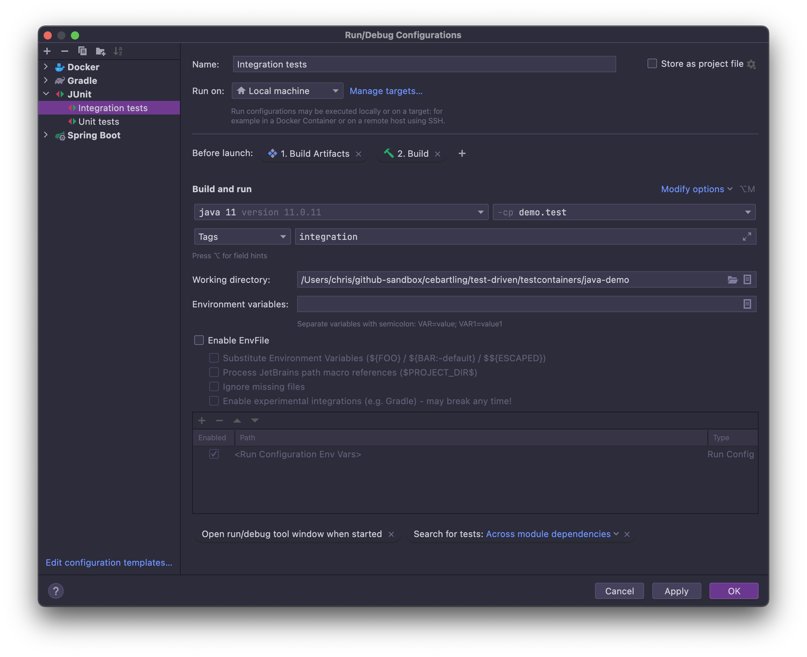
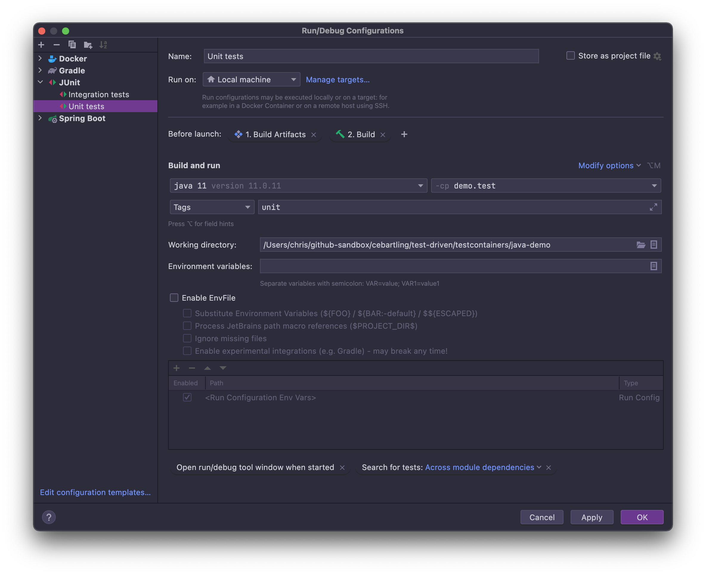
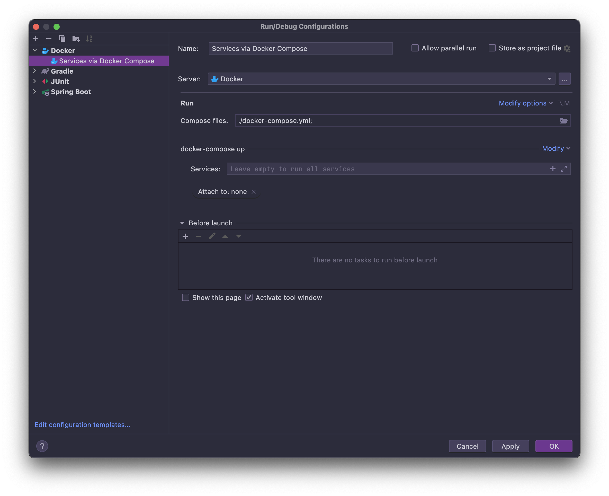
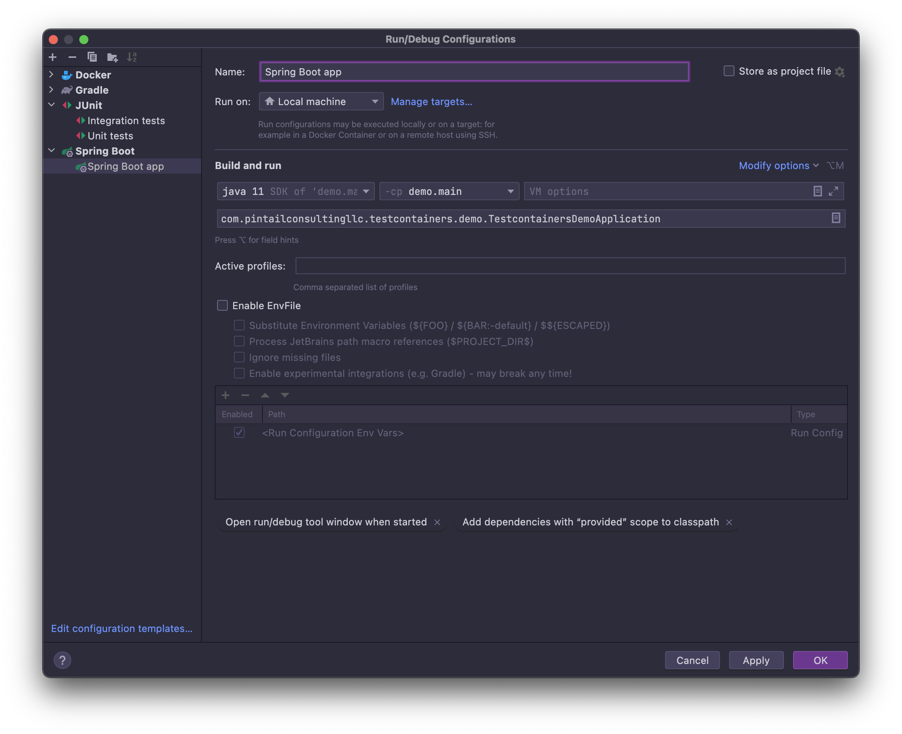

# Testcontainers Java Demo

## Project overview

This Java project demonstrates the use of [Testcontainers](https://www.testcontainers.org/) to facilitate integration testing.
Testcontainers is a Java library that supports JUnit 4/5 and Spock tests, providing lightweight, throwaway instances of common databases, Selenium web browsers, or anything else that can run in a Docker container.

This example is pretty simple; a single PostgreSQL database is the only external dependency that is managed by Testcontainers within JUnit 5 integration tests.

## Development

This project uses Java 11 SDK. The easiest way to manage your Java SDK versions is to use [SDKMAN](https://sdkman.io/). Ensure that an appropriate Java 11 SDK is configured in your environment before attempting to build the project or run tests.

### Command-line

This project uses [Gradle](https://gradle.org/) as the project build tool. The easiest way to exercise the tests in this project is to run them from the command line via `gradlew`, the Gradle wrapper (included as part of the project). 

Use `./gradlew build` from the project's root directory to build the project and run all the tests. This will run both unit and integration tests.

### IntelliJ IDEA IDE

The Gradle build will also generate IntelliJ IDEA project files and open the IDE. Again, from the command-line, use `./gradlew openIdea` to generate the IntelliJ IDEA project files and open the IDE. Once in the IDE, you should be able to run all the tests by selecting the `src/test/java` directory in the Project View and right clicking the folder for the context-aware popup menu and selecting the **Run 'Tests in demo.test'** menu item.

Run configurations for unit and integration tests can also be configured within the IDE:

Run configurations for the Spring Boot app and Docker Compose, which is used for PostgreSQL database when running the Spring Boot app:

